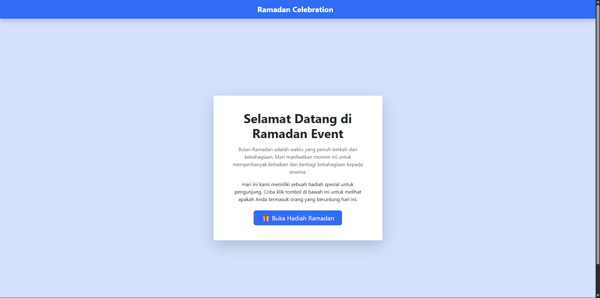

# NIM : 2311102298

# Nama : Nok Nadia

---

# Website Ramadan Celebration

## Deskripsi

Website **Ramadan Celebration** merupakan halaman web sederhana bertema Ramadan yang dibuat menggunakan **Bootstrap 5**.

Website ini menampilkan halaman utama yang berisi pesan tentang bulan Ramadan dan sebuah tombol interaktif yang dapat diklik oleh pengguna. Ketika tombol tersebut ditekan, akan muncul **popup modal** yang menampilkan pesan bahwa pengguna mendapatkan **THR Ramadan**.

Website ini dibuat sebagai latihan untuk memahami penggunaan **Bootstrap Components** dalam membuat tampilan web yang rapi dan menarik tanpa menggunakan CSS manual.

---

# Fitur Website

Beberapa fitur yang terdapat pada website ini yaitu:

### 1. Navbar

Navbar digunakan sebagai bagian header website yang menampilkan judul **Ramadan Celebration**.

### 2. Card Content

Card digunakan sebagai bagian utama halaman yang berisi:

- Judul halaman
- Deskripsi singkat tentang Ramadan
- Tombol untuk membuka hadiah

### 3. Button Interaktif

Tombol digunakan untuk memicu munculnya modal ketika diklik oleh pengguna.

### 4. Modal Popup

Modal akan muncul ketika tombol ditekan dan menampilkan pesan bahwa pengguna mendapatkan **THR Ramadan**.

---

# Teknologi yang Digunakan

Website ini dibuat menggunakan teknologi berikut:

- HTML5
- Bootstrap 5
- Bootstrap Modal Component

Bootstrap digunakan melalui **CDN** sehingga tidak memerlukan instalasi tambahan.

---

Penjelasan:

- **ramadan.html**
  Berisi kode utama halaman website Ramadan.

- **images/**
  Folder yang berisi screenshot tampilan website.

- **README.md**
  Berisi dokumentasi dan penjelasan project.

---

# Penjelasan Kode

## Bootstrap CDN

Bootstrap digunakan melalui CDN agar styling Bootstrap dapat langsung digunakan pada halaman web.

```
<link href="https://cdn.jsdelivr.net/npm/bootstrap@5.3.2/dist/css/bootstrap.min.css" rel="stylesheet">
```

Script Bootstrap juga digunakan agar fitur seperti **modal popup** dapat berjalan.

```
<script src="https://cdn.jsdelivr.net/npm/bootstrap@5.3.2/dist/js/bootstrap.bundle.min.js"></script>
```

---

## Navbar

Navbar digunakan sebagai header halaman website.

```
<nav class="navbar navbar-dark bg-primary">
```

Class Bootstrap yang digunakan:

- **navbar** → komponen navbar
- **navbar-dark** → tema teks navbar
- **bg-primary** → warna background navbar

---

## Card

Card digunakan untuk menampilkan konten utama website.

```
<div class="card shadow-lg text-center">
```

Card berisi:

- Judul halaman
- Deskripsi Ramadan
- Tombol untuk membuka hadiah

---

## Button

Button digunakan untuk memunculkan modal.

```
<button data-bs-toggle="modal" data-bs-target="#thrModal">
```

Penjelasan:

- **data-bs-toggle="modal"** → mengaktifkan modal
- **data-bs-target="#thrModal"** → menghubungkan tombol dengan modal

---

## Modal

Modal digunakan untuk menampilkan pesan ketika pengguna berhasil membuka hadiah Ramadan.

```
<div class="modal fade" id="thrModal">
```

Modal akan muncul di tengah layar dan menampilkan pesan bahwa pengguna mendapatkan **THR Ramadan**.

---

# Tampilan Website

## Halaman Utama



---

## Tampilan Popup THR


---

# Kesimpulan

Website **Ramadan Celebration** dibuat menggunakan Bootstrap untuk menghasilkan tampilan web yang rapi dan interaktif tanpa menggunakan CSS tambahan.

Dengan memanfaatkan komponen Bootstrap seperti:

- Navbar
- Card
- Button
- Modal

kita dapat membuat halaman web sederhana yang menarik dan mudah dikembangkan lebih lanjut.

---

# Terima Kasih
